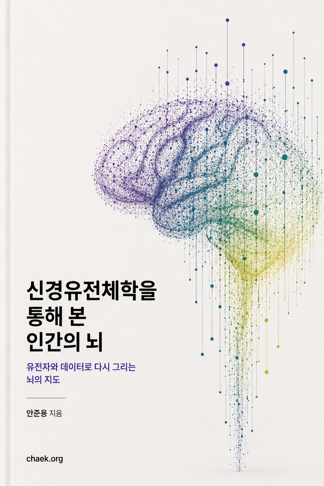

# 신경유전체학을 통해 본 인간의 뇌

저자: 안준용 (고려대학교 보건과학대학 바이오시스템의과학부)

  

---

인간의 뇌는 약 2만 개의 유전자로부터 3,000가지 이상의 세포 유형을 만들어낸다. 이 책은 유전체 기술이 인간 뇌의 분자적 구조를 어떻게 밝혀왔는지를 따라간다. 2011년 최초의 뇌 시공간 전사체에서 시작하여, 단일 세포 아틀라스, 피질과 비-피질 영역의 세포 유형 다양성, 유전자 네트워크의 기능적 수렴, 시냅스 단백질체의 진화, 영장류 비교 전사체학, 뇌 오가노이드, 그리고 대규모 유전자 기능 스크리닝까지, 이 분야가 지난 15년 동안 걸어온 길을 정리한다.

*마지막 수정: 2026년 4월*
